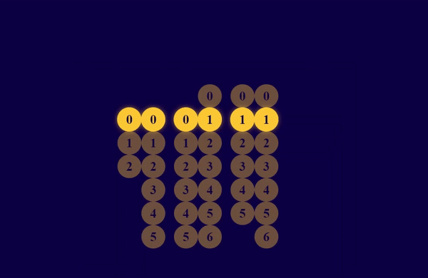

# Styled Countdown

Cronômetro feito tendo como base um projeto mecânico visto no linkedin onde o engenheiro usava da robótica para fazer uma criação similar

Inspirado por este autor (do qual infelizmente não me recordo o nome), resolvi criar minha própria versão WEB

## Linguagens

- HTML
- CSS

## Funcionamento

O cronômetro mostra as 24 horas do dia

### Limitação

Considerando que não usei javascript no projeto fiquei limitado ao que o CSS podia oferecer, dessa forma o cronômetro funciona até 29 horas ao invés de 24

Dessa forma podemos chamá-lo de 'cronômetro dos sonhos', afinal, quem não gostaria de mais 5 horas no dia, em?

## Preview

    

Live preview no codepen: https://codepen.io/fabioguedesj/full/mdqLPJq